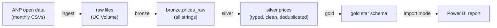
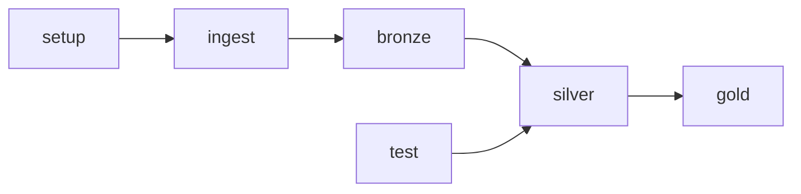
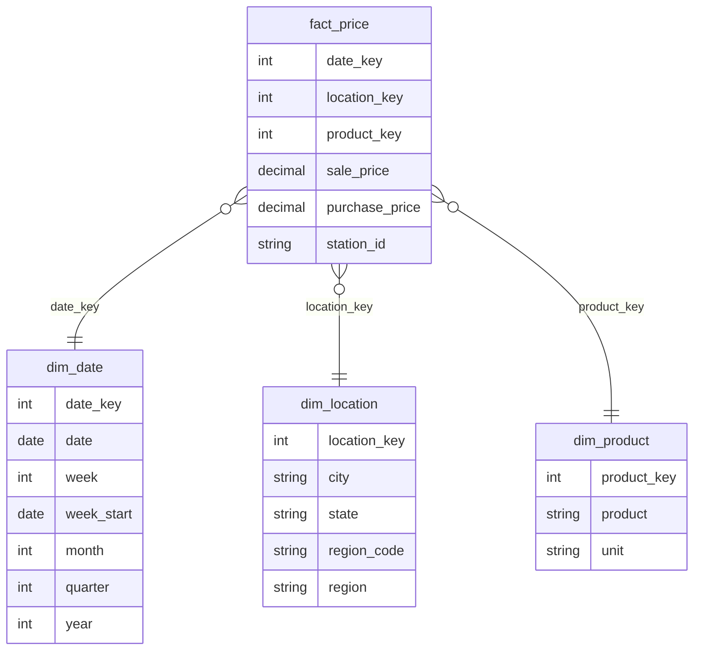

# FleetFuel Analytics

End-to-end data pipeline that turns Brazil's public fuel price survey (ANP) into a star schema on Databricks and a Power BI report with a fleet fuel cost simulator.

Built on **Databricks Free Edition** (serverless only), deployed as a **Databricks Asset Bundle**, and following the **medallion architecture** (raw → bronze → silver → gold) in **Unity Catalog**.

## Why

Diesel is one of the largest costs for any truck fleet. ANP publishes weekly prices from thousands of gas stations across Brazil, but only as raw monthly CSVs. This project answers three questions:

- What is the average diesel and gasoline price today, by state and region?
- How have prices moved over the last 12 months?
- How much would a given fleet spend on fuel per month in each region?

## Architecture



A single job, `anp_fuel_pipeline`, runs every step on serverless compute:



| Task | Source | What it does |
|---|---|---|
| `setup` | [`src/00_setup.sql`](src/00_setup.sql) | Creates the catalog, the `raw`/`bronze`/`silver`/`gold` schemas and the landing Volume. |
| `ingest` | [`src/01_ingest.py`](src/01_ingest.py) | Downloads the ANP diesel and gasoline CSVs for the configured years. Files already in the Volume are skipped. |
| `bronze` | [`src/02_bronze.py`](src/02_bronze.py) | Loads new CSVs into `bronze.prices_raw` as strings, with source file and load timestamp. Incremental and idempotent. |
| `test` | [`tests/run_tests.py`](tests/run_tests.py) | Runs the pytest suite for the silver rules on serverless. Silver does not run if a test fails. |
| `silver` | [`src/03_silver.py`](src/03_silver.py) | Renames columns to English, parses prices and dates, normalizes text, keeps DIESEL, DIESEL S10 and GASOLINA, deduplicates. |
| `gold` | [`src/04_gold.sql`](src/04_gold.sql) | Rebuilds the star schema and a weekly aggregate. |

### Gold model



`fact_price` has one row per station, product and survey day. `agg_price_weekly` holds the average, min and max price and the station count per state, region, product and week.

## Data quality

Each layer fails its task when a check does not pass, so bad data never reaches the report:

- **Bronze:** every loaded file has exactly as many rows as its CSV has data rows.
- **Silver:** sale price between R$ 1 and R$ 15 per liter, no null keys, and no more rows than bronze.
- **Gold:** no null keys in the fact table, every fact row matches its dimensions, and the fact table has the same row count as silver.
- **Unit tests:** the cleaning rules live in [`src/anp_fuel/silver_rules.py`](src/anp_fuel/silver_rules.py) as pure DataFrame functions. [`tests/test_silver_rules.py`](tests/test_silver_rules.py) tests them on small in-memory DataFrames.

## Power BI

The report connects to the Databricks SQL Warehouse in **Import** mode and reads only the `gold` schema. All measures are in [`powerbi/measures.dax`](powerbi/measures.dax).

- **Overview:** current average price, 12-month change, and a map by state.
- **Trend:** weekly price by region and product.
- **Fleet simulator:** monthly fuel cost by region, driven by three what-if parameters (number of trucks, km per truck per month, consumption in km/l):

  `monthly cost = trucks × km per truck ÷ km per liter × average DIESEL S10 price`

## How to run

**Requirements:** a Databricks workspace (Free Edition works) and the [Databricks CLI](https://docs.databricks.com/dev-tools/cli/install.html) authenticated to it.

1. Set `workspace.host` in [`databricks.yml`](databricks.yml) to your workspace URL.
2. Validate, deploy and run:

   ```bash
   databricks bundle validate
   databricks bundle deploy -t dev
   databricks bundle run anp_fuel_pipeline -t dev
   ```

3. Optional: override the bundle variables.

   ```bash
   databricks bundle deploy -t dev --var="catalog=my_catalog" --var="years=2024,2025"
   ```

| Variable | Default | Description |
|---|---|---|
| `catalog` | `anp_fuel` | Unity Catalog catalog for all schemas. |
| `years` | `2023,2024,2025` | ANP survey years to ingest. |

4. In Power BI Desktop, connect to your SQL Warehouse with the Azure Databricks connector, import the `gold` tables, and add the measures from `powerbi/measures.dax`.

## Project structure

```
├── databricks.yml            # bundle definition and variables
├── resources/
│   └── anp_fuel_job.yml      # job with all tasks
├── src/
│   ├── 00_setup.sql
│   ├── 01_ingest.py
│   ├── 02_bronze.py
│   ├── 03_silver.py
│   ├── 04_gold.sql
│   └── anp_fuel/
│       └── silver_rules.py   # testable cleaning rules
├── tests/
│   ├── conftest.py
│   ├── run_tests.py          # runs pytest as a job task
│   └── test_silver_rules.py
└── powerbi/
    └── measures.dax
```

## Tech stack

Databricks (Unity Catalog, Delta Lake, serverless jobs, Asset Bundles) · PySpark · Spark SQL · pytest · Power BI (DAX)

## Data source

[ANP: Série histórica de preços de combustíveis](https://www.gov.br/anp/pt-br/centrais-de-conteudo/dados-abertos/serie-historica-de-precos-de-combustiveis), published by Brazil's National Agency of Petroleum, Natural Gas and Biofuels under its open data policy.
